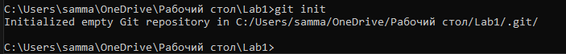
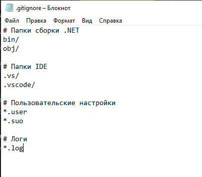
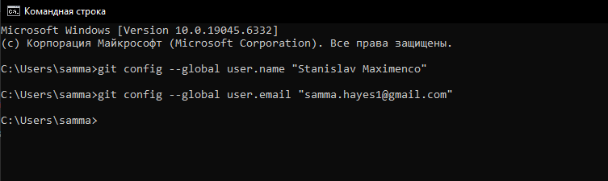
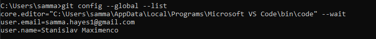
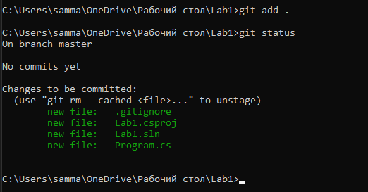
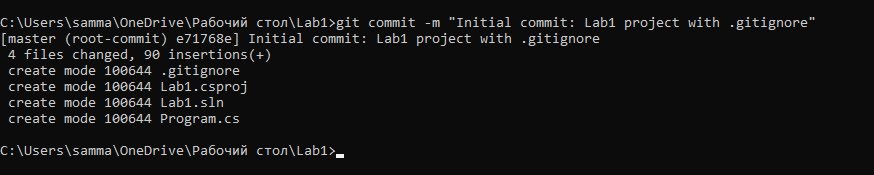
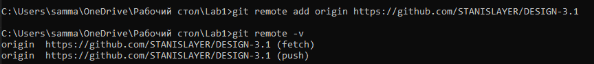
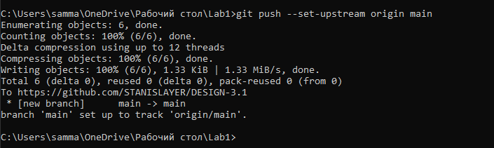

# DESIGN-3

Для начала я инициализировал git репозиторию для своего проекта проекта

Далее я добавил .gitignore и прописал в нём какие файлы не отслеживать.

Затем я сконфигурировал свои данные в гит

Затем я прописал git add

Затем сделал сам git commit с .gitignore

Далее я создал репозиторию на гитхабе и связал её с гитовской

